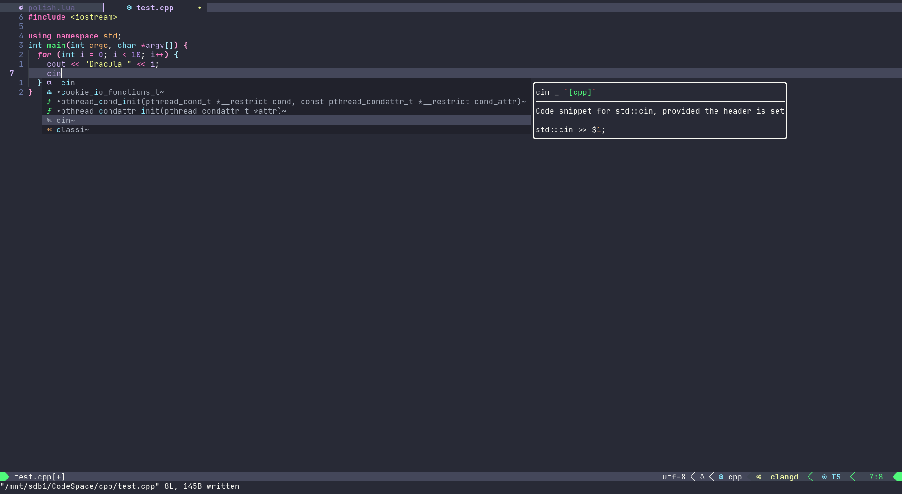
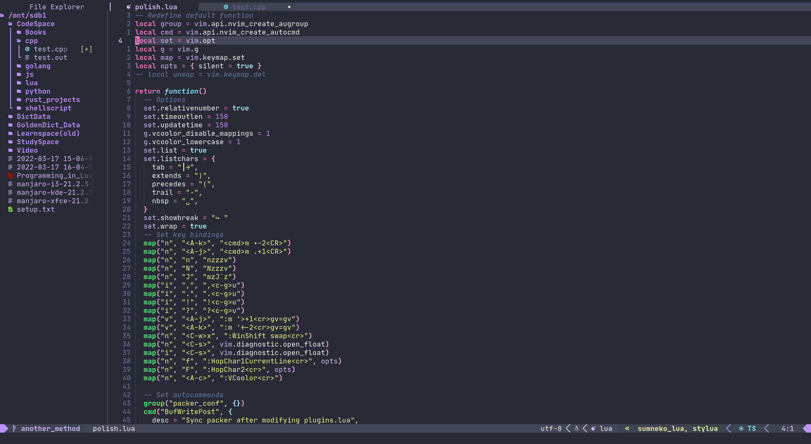
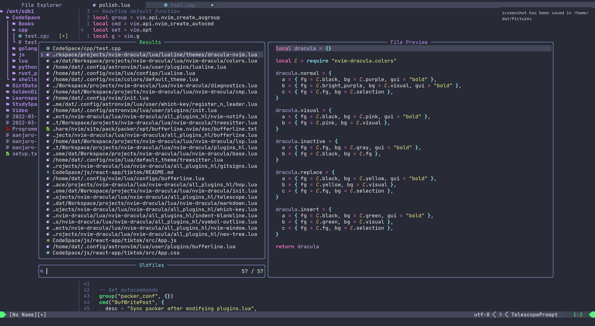
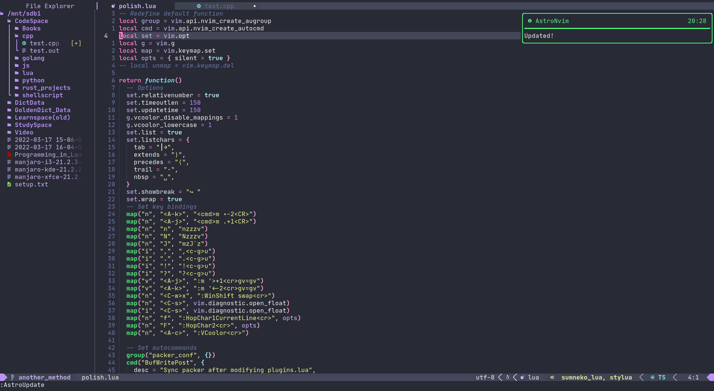
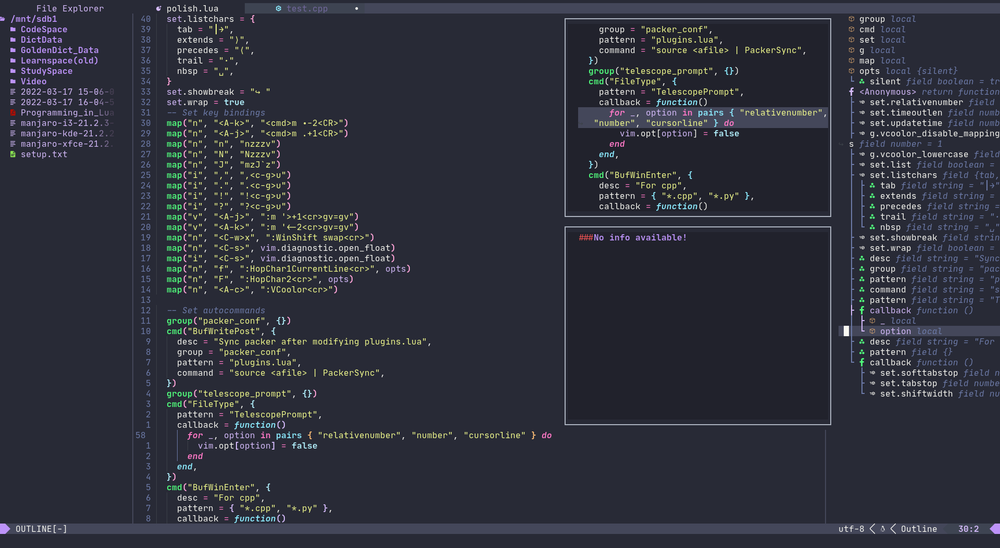

# It's just my personal Dracula theme :))

# How to install it

Put this in your `init.lua`

```lua
use "datamonsterr/nvim-dracula"
```

# Support Plugins

1. [Bufferline](https://github.com/akinsho/bufferline.nvim)
2. [Neo-tree](https://github.com/nvim-neo-tree/neo-tree.nvim)
3. [Lualine](https://github.com/nvim-lualine/lualine.nvim)
   You need to use this to make this lualine theme works

```lua
require("lualine").setup {
    options = {
        theme = "dracula-nvim"
      }
  }
```

4. [gitsigns](https://github.com/lewis6991/gitsigns.nvim)
5. [indent-blankline](https://github.com/lukas-reineke/indent-blankline.nvim)
6. [Notify](https://github.com/rcarriga/nvim-notify)
7. [nvim-web-devicons](https://github.com/kyazdani42/nvim-web-devicons)
8. [Telescope](https://github.com/nvim-telescope/telescope.nvim)
9. [WhichKey](https://github.com/folke/which-key.nvim)

# If you want to get the colors palete

`require "nvim-dracula.colors"`

# Ask me something?

Just create an issue whatever it is a question, bug or feature request.

# Screenshots










